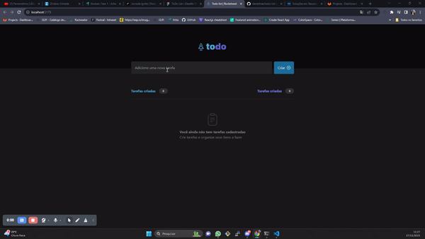

<div align="center">
  
</div>
<br>

<br>
<hr>
<p align="center">
  Este é um aplicativo de tarefas simples como parte do treinamento do Rocketseat <br> 
</p>



<br>

<hr>

<br>
<h2 align="center">Features 🛠</h2>
[x] - Criar uma tarefa <br>
[x] - Deletar uma tarefa <br>
[x] - Completar uma tarefa <br>

<br>
<hr>
<h2 align="center">Tecnologias</h2>
<br>
<div align="center">


</div>
<hr>

<br>
<h2 align="center">Como executar este projeto</h2>
<br>

Clone este repositório:

```bash
    git clone https://github.com/daniellvaz/todo-list-rocketseat
```

dentro da pasta do projeto execute:

```bash
    yarn install
```

ou

```bash
    npm install
```

ou

```bash
    pnpm install
```

<hr>

<h2 align="center">License 📃</h2>
<br>
<a href="">MIT licensed</a>
